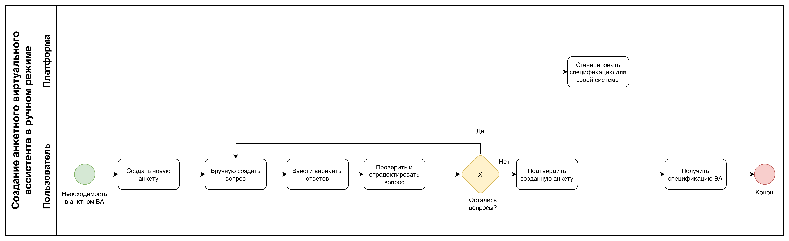
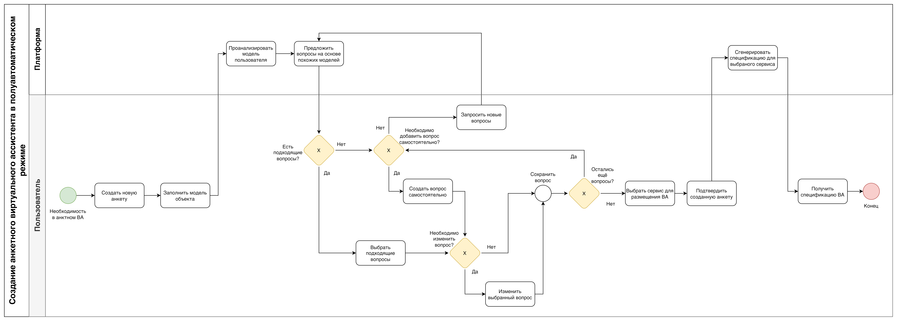

# Сравнение бизнес-процессов AS-IS и TO-BE

Анализ бизнес-процессов играет ключевую роль в развитии любой системы, так как он помогает выявить проблемные области и определить возможные пути для оптимизации. В рамках данного исследования будет произведено сравнение на основе процесса создания анкетного виртуального ассистента. Это позволит выявить недостатки текущего состояния процессов и создать модель желаемого состояния, что, в свою очередь, способствует повышению удобства, гибкости и эффективности использования системы для конечных пользователей.

## Процесс AS-IS

В процессе AS-IS, который реализован на существующих платформах, пользователи начинают с ручного создания анкеты, вводя каждый вопрос и варианты ответов. После этого они могут проверять и редактировать введенные данные, повторяя процесс для каждого нового вопроса, пока не создадут полную анкету. Этот процесс продемонстрирован на рисунке 1.

Рисунок 1 - Процесс AS-IS

Основной недостаток процесса AS-IS заключается в том, что создание анкеты полностью зависит от пользователя, что требует значительных временных затрат и специальных знаний. Кроме того, ручной ввод может привести к ошибкам или дублированию вопросов, что ухудшает качество финальной анкеты. В итоге спецификация анкетного ассистента формируется с учетом требований платформы, что делает ее привязкой к конкретной системе и затрудняет возможность размещения на других сервисах. Таким образом, AS-IS процесс ограничивает гибкость и увеличивает время, необходимое для создания анкет, что может затруднить проведение исследований и сбор данных.

## Процесс TO-BE

В процессе TO-BE платформа устраняет недостатки предыдущего подхода, предлагая пользователям полуавтоматизированный процесс создания анкеты. Пользователь сначала заполняет модель объекта — это структурированная информация о респонденте или о каком-либо объекте, который будет участвовать в анкетировании. Модель объекта включает такие данные, как возраст, пол, интересы, профессия и другие характеристики, которые помогут системе лучше понять контекст и цели анкетирования.

Система анализирует модель пользователя и на основе этой информации генерирует релевантные вопросы, опираясь на данные о похожих моделях пользователей. Пользователь может просмотреть предложенные вопросы, выбрать подходящие и при необходимости дополнить анкету новыми вопросами или отредактировать уже существующие.

В конце создания виртуального ассистента пользователь имеет возможность выбрать сервис, на котором он хочет разместить ассистента. Этот выбор влияет на структуру сгенерированной спецификации ассистента, адаптируя ее под требования конкретной платформы.

Этот подход значительно снижает временные затраты на создание анкет и минимизирует риск ошибок, связанных с ручным вводом данных. Пользователь также получает возможность легко сохранять и адаптировать анкету под свои нужды без необходимости повторного ввода информации. Данный процесс показан на рисунке 2.

Рисунок 2 - Процесс TO-BE

Предлагаемый процесс TO-BE позволит достичь более высокой гибкости и эффективности в создании анкетных ориентированных виртуальных ассистентов, сокращая необходимость в ручном вводе и предоставляя удобные инструменты для адаптации контента на основе анализа модели пользователя. Это также позволит проводить анкетирование более точно и релевантно, так как вопросы будут автоматически формироваться с учетом особенностей модели пользователя.
