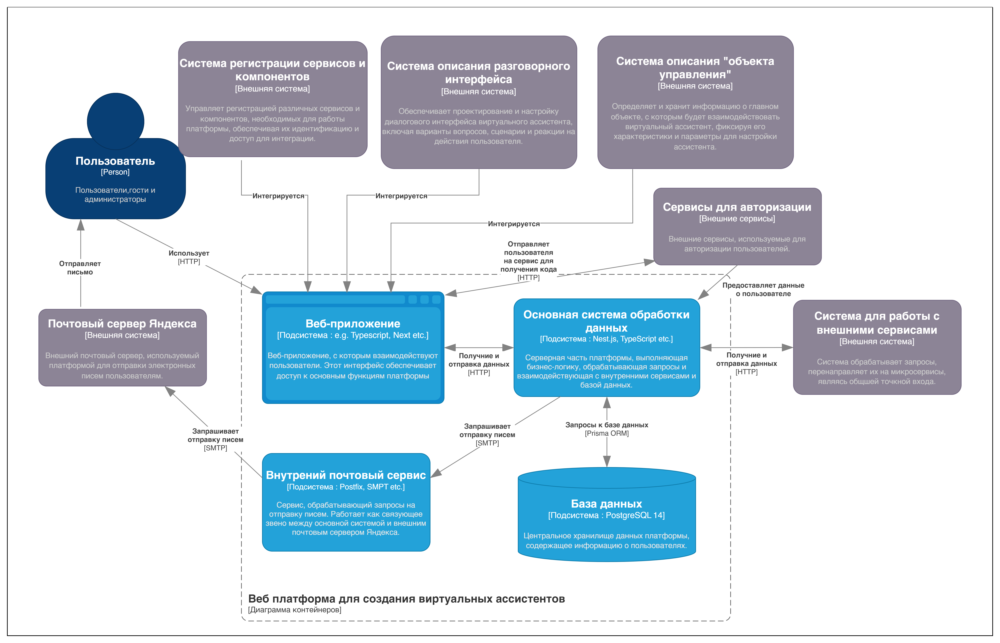

# Проектирование архитектуры приложения

Проектирование архитектуры приложения является ключевым этапом в разработке, определяющим его структуру, компоненты и взаимодействие между ними. Архитектура построена с использованием модели C4, что позволяет четко разделить систему на уровни и представить ее компоненты в понятной и логичной структуре. Модель C4 помогает визуализировать взаимосвязи между различными частями приложения и их взаимодействие, начиная от высокоуровневого представления и заканчивая детальными описаниями компонентов.

## Диаграмма контекста

Первый уровень модели C4 охватывает высокоуровневые сущности и процессы, которые выполняются в рамках платформы для создания виртуальных ассистентов. Здесь описываются взаимодействия между пользователями, веб-платформой, внешними сервисами, такими как почтовый сервер и сервисы авторизации, а также другими системами, такими как генерация спецификации и вопросов на основе модели пользователя. Диаграмма контекста веб-платформы изображена на рисунке 1.

Рисунок 1 - Диаграмма контекста

Ключевыми элементами на этом уровне являются пользователи, веб-платформа для создания виртуальных ассистентов, внешние сервисы авторизации и почтовый сервер. Пользователи, гости и администраторы представлены как отдельные сущности, и все действия на платформе связаны с их взаимодействием с системой. Это включает авторизацию через внешние сервисы и получение уведомлений, таких как подтверждения регистрации и активации учетной записи.

Веб-платформа для создания виртуальных ассистентов является основным инструментом, предоставляющим интерфейс для управления процессом создания виртуальных ассистентов. Она включает создание, редактирование и управление ассистентами, а также обработку данных и взаимодействие с другими компонентами системы.

Для быстрого входа в систему используются внешние сервисы авторизации. Эти сервисы обеспечивают надежную аутентификацию пользователей через механизмы OAuth и передают необходимые данные о пользователях на веб-платформу для дальнейшего взаимодействия.

Почтовый сервер, в частности сервер Яндекса, играет важную роль в отправке уведомлений пользователям. Он используется для отправки писем, таких как уведомления о подтверждении регистрации, активации учетной записи и других важных действиях, которые требуют информирования пользователя.

Система для работы с внешними сервисами служит точкой входа для обмена данными, обеспечивая доступ к различным микросервисам, включая генерацию спецификаций, создание анкет и генерацию вопросов по модели пользователя. Этот элемент системы закладывает основу для дальнейшего расширения и интеграции платформы с другими микросервисами.

Важно отметить, что системы описания разговорного интерфейса, системы описания «объекта управления» и системы регистрации сервисов и компонентов были разработаны или начаты как независимые решения, не связанные с платформой. Одной из ключевых задач является интеграция этих систем в платформу с использованием архитектуры single-spa, что позволит импортировать и объединить их как полноценные модули.

## Диаграмма контейнеров

На втором уровне архитектурной модели C4 мы рассматриваем контейнеры платформы для создания виртуальных ассистентов. Эти контейнеры обеспечивают функционирование всех ключевых элементов системы, взаимодействуя между собой и с внешними сервисами. Каждый контейнер выполняет свою специфическую роль, обеспечивая целостность и эффективность работы платформы. На рисунке 2 представлена диаграмма контейнеров.

Рисунок 2 - Диаграмма контейнеров

Платформа состоит из четырёх контейнеров, включая веб-приложение, основную систему обработки данных, внутренний почтовый сервис и базу данных. Веб-приложение служит клиентской частью платформы, предоставляя пользователю интерфейс для создания, настройки и управления виртуальными ассистентами. Оно взаимодействует с основной системой обработки данных через API-запросы, обеспечивая отображение данных и отправку действий пользователя на серверную часть. Веб-приложение работает с внешними сервисами авторизации, такими как GitHub, VK и Yandex, и после выбора пользователем нужного сервиса для авторизации перенаправляет его на соответствующий сервис. После успешной авторизации веб-приложение обрабатывает результат, полученный от сервиса, и продолжает взаимодействовать с основной системой обработки данных для дальнейшей работы с пользователем. Кроме того, веб-приложение взаимодействует с другими системами платформы через Single SPA, что позволяет интегрировать компоненты платформы, такие как системы описания разговорного интерфейса, системы описания «объекта управления» и системы регистрации сервисов и компонентов.

Основная система обработки данных является серверной частью платформы, отвечающей за обработку всех данных, связанных с платформой. Система взаимодействует с базой данных через Prisma ORM, что позволяет эффективно управлять хранением и извлечением информации. Используя ORM, основная система работы с данными обеспечивает доступ к базе данных, выполняя запросы для создания, обновления и удаления данных, связанных с виртуальными ассистентами, их настройками и историей взаимодействий. Также система взаимодействует с внешними сервисами через API, включая авторизацию и получение данных пользователей через OAuth и обмен данными с внешними микросервисами. Немаловажной частью функционала основной системы является создание запросов внутреннему почтовому сервису на отправку писем.

Внутренний почтовый сервис, в свою очередь, работает как связующее звено между основной системой обработки данных и внешним почтовым сервером, таким как Яндекс или другими SMTP-серверами. Этот сервис обрабатывает запросы на отправку писем — уведомлений, подтверждений и других сообщений — и обеспечивает коммуникацию между платформой и пользователями.

База данных хранит все критически важные данные платформы, включая информацию о пользователях, настройках виртуальных ассистентов, истории их взаимодействий и другие необходимые данные. Она тесно взаимодействует с основной системой обработки данных, предоставляя необходимую информацию для обработки запросов и создания виртуальных ассистентов.

Взаимодействие между всеми этими компонентами, через специально настроенные интерфейсы и протоколы, позволяет платформе работать как единое целое, обеспечивая надежность и функциональность всех операций, связанных с созданием виртуальных ассистентов.

## Диаграмма компонентов

На третьем уровне архитектуры мы рассматриваем контейнер "Веб-приложение", который представляет собой клиентскую часть платформы. Этот контейнер включает в себя важные компоненты, обеспечивающие функциональность и взаимодействие с пользователем, а также с другими частями системы. Диаграмма компонентов продемонстрирована на рисунке 3.

Рисунок 2 - Диаграмма компонентов

Компонент интеграции микрофронтендов (Single-SPA) отвечает за динамическую загрузку и интеграцию микрофронтендов, что позволяет эффективно управлять различными частями интерфейса, независимо от их реализации и технологий. Это дает возможность приложениям гибко загружать и отображать различные модули в зависимости от нужд пользователя, улучшая производительность и масштабируемость. Каждый микрофронтенд располагается на определённом маршруте, что создаёт связь с компонентом маршрутизации, обеспечивая корректную загрузку и отображение соответствующих модулей при переходе между различными страницами приложения.

UI-компоненты и библиотека элементов интерфейса (Next UI, Tailwind CSS) содержат готовые элементы, которые отвечают за внешний вид и взаимодействие с пользователем. Эти компоненты обеспечивают единый стиль и интерфейс для веб-приложения, включая формы, кнопки, навигацию и другие элементы управления. Они взаимодействуют с компонентом управления запросами, так как некоторые компоненты, например аватар пользователя, требуют получения данных с сервера для отображения. Также существует связь с сервисами авторизации, поскольку определённые компоненты выполняют переадресацию пользователя на сторонние сервисы для авторизации, например, при выборе кнопок для входа через GitHub или VK.

Компонент обработки авторизации через сервисы (Typescript) занимается обработкой ответов от внешних сервисов при авторизации через сторонние платформы. Он взаимодействует с внешними сервисами авторизации и сервером, обеспечивая корректное выполнение логики авторизации и безопасный обмен данными между клиентом и сервером. Обработка ответа часто подразумевает необходимость выполнения дополнительного запроса к серверу, что создаёт связь с компонентом управления запросами для организации асинхронного обмена данными и обеспечения правильного обработки всех авторизационных процессов.

Компонент маршрутизации (Next.js App Router) отвечает за обработку маршрутов и определяет, какие страницы и компоненты отображать в зависимости от URL. Это позволяет пользователю перемещаться по приложению, не теряя контекста, а веб-приложение динамично подгружает соответствующие страницы и ресурсы.

Middleware (Next.js Middleware) выполняет промежуточные шаги для обработки запросов, направляя их в соответствующие обработчики. Этот компонент играет важную роль в настройке обработки запросов, таких как аутентификация, авторизация и редиректы. Он необходим для того, чтобы обезопасить определённые страницы от несанкционированного доступа, например, для неавторизованных пользователей. Благодаря Middleware можно настроить логику проверки прав доступа и перенаправление пользователей в случае неудачной авторизации, что позволяет эффективно управлять безопасностью приложения и улучшать пользовательский опыт.

Компонент управления запросами (TanStack Query, React Query) управляет асинхронными запросами, обеспечивая быстрый и эффективный обмен данными между клиентом и сервером. Все запросы к Основной системе обработки данных происходят именно через этот компонент. Это включает в себя как мутации (например, создание, обновление или удаление данных), так и получение данных. Используя этот компонент, веб-приложение может быстро и эффективно взаимодействовать с сервером, обеспечивая актуальность и целостность данных, передаваемых между клиентом и серверной частью платформы.
