# Проектирование пользовательского интерфейса

Проектирование пользовательского интерфейса фокусируется на создании архитектуры, обеспечивающей логичное и удобное взаимодействие с системой. Интерфейс должен учитывать сложность платформы, объединяющей множество процессов и интеграций, и предоставлять пользователям доступ к функциям через четкую и понятную структуру. Важным аспектом является обеспечение согласованности элементов интерфейса, что позволяет легко переключаться между различными разделами платформы и взаимодействовать с внешними сервисами без потери удобства.

## Иерархия экранов приложения

Иерархия экранов платформы организована таким образом, чтобы обеспечить удобную навигацию, логичное разделение функциональности и масштабируемость для добавления новых модулей. Структура экранов состоит из нескольких ключевых разделов, каждый из которых отвечает за выполнение конкретных задач пользователя. На рисунке 1 изображена иерархия экранов приложения.

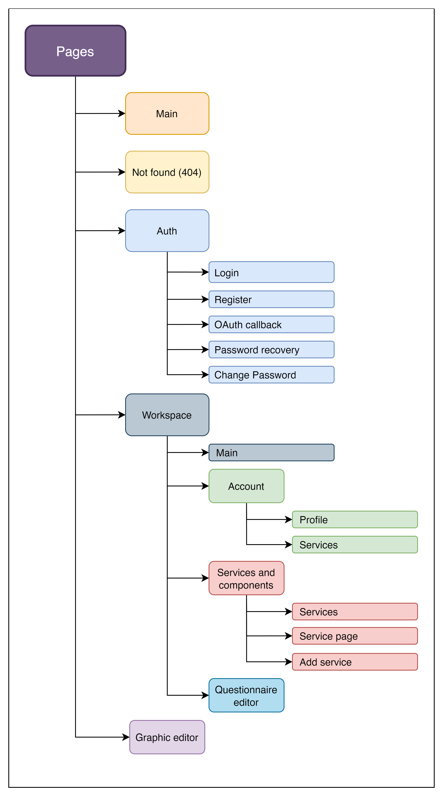

Рисунок 1 - Иерархия экранов

Главная страница платформы доступна только гостям и служит точкой входа, предоставляя базовую информацию о возможностях платформы и её основных функциях. Она предназначена для ознакомления с платформой, чтобы новые пользователи могли понять её преимущества и особенности. Также предусмотрена страница "Not found", которая отображается в случае попытки перехода на несуществующий маршрут.

Одной из основных групп экранов является "Auth", предназначенная для авторизации и управления доступом. В неё входят страницы для входа, регистрации, обработки ответов от внешних сервисов OAuth, а также восстановления и изменения пароля.

Центральное место в архитектуре платформы занимает "Workspace" — рабочее пространство, оснащенное сайдбаром для удобной навигации между различными подгруппами и разделами. Главная страница Workspace позволяет переходить к необходимым для пользователя разделам для работы, а также предоставляет доступ к ключевой информации, статистике или актуальным новостям, связанным с использованием платформы.

В Workspace предусмотрены разделы, такие как аккаунт, где пользователь может управлять своей учетной записью. В этом разделе представлены страницы профиля, содержащие данные о пользователе, и список сервисов, привязанных к аккаунту.

Раздел сервисом и компонентов предоставляет инструменты для работы с сервисами и компонентами виртуальных ассистентов. В него входят страницы для просмотра списка сервисов, отображения данных об отдельном сервисе и добавления новых.

Отдельное место занимают два инструмента: Questionnaire Editor и Graphic Editor. Questionnaire Editor — это графический редактор для настройки и создания виртуальных ассистентов. Он интегрируется в платформу как микрофронтенд, разработанный сторонней командой. Graphic Editor, в свою очередь, представляет собой полноценную страницу для графического редактирования ассистентов, также добавляемую как микрофронтенд.

## Техническое описание экранов

Техническое описание экранов содержит таблицу, где для каждого экрана описаны его название, состояния, правила валидации данных, дополнительные элементы интерфейса и поведение. Таблица позволяет четко представить функционал экранов, их логику и реакции на действия пользователя. На рисунке 2 представлена таблица с техническим описанием экранов.

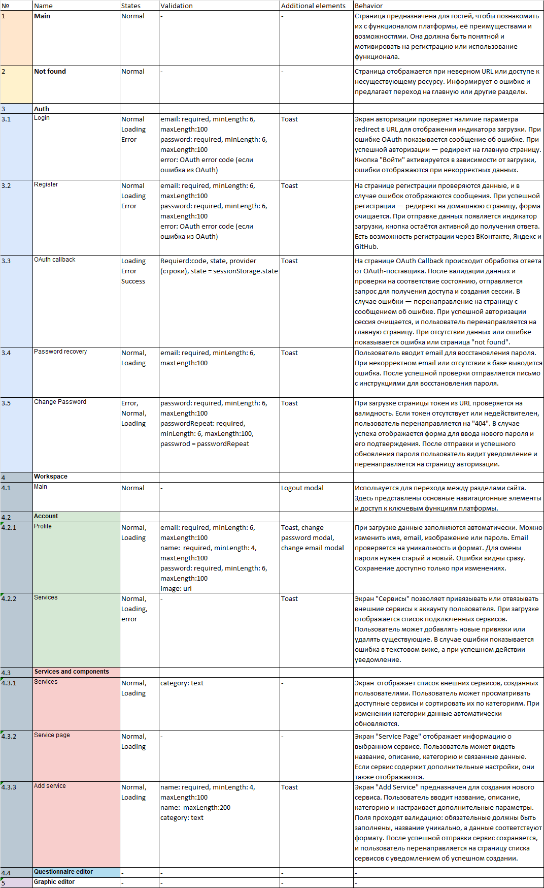

Рисунок 2 - Техническое описание экранов

Экраны анкетного и графического редакторов включены в таблицу, но информация о них не указана, так как их разработкой занимаются другие группы студентов. Эти модули будут импортированы в проект в виде микрофронтендов.

## Макеты экранов

Макеты отображают структуру экранов и помогают понять, где размещены ключевые элементы, обеспечивая основу для разработки и удобство взаимодействия.

В шапке главной страницы расположены логотип и кнопка «Войти», при нажатии на которую пользователь перенаправляется на страницу авторизации. В центре страницы находятся лозунг платформы и кнопка «Создать сейчас», которая также ведет на страницу авторизации. Свободное пространство можно заполнить кратким описанием платформы или статистикой. На рисунке 3 представлен макет главной страницы.

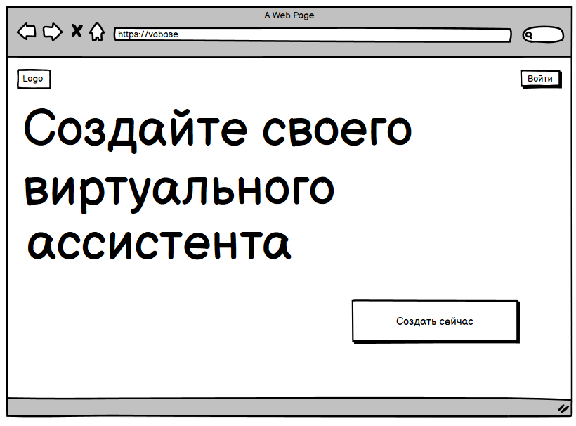

Рисунок 3 - Макет главной страницы

Страница входа в аккаунт включает форму, где пользователь может выбрать сервис для авторизации или ввести данные вручную. Для ручного ввода необходимо нажать кнопку «Войти» для аутентификации. Также предусмотрена кнопка «Забыли пароль» для восстановления доступа. Если аккаунт ещё не создан, доступна кнопка «Создать». На рисунке 4 показан макет страницы входа в аккаунт.

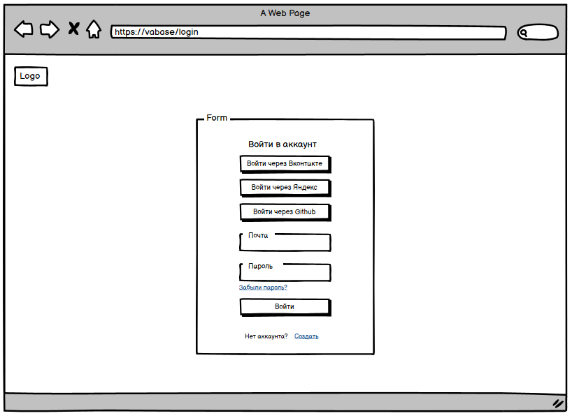

Рисунок 4 - Макет страницы входа в аккаунт

Страница создания аккаунта похожа на страницу входа, но с изменённой логикой формы. На рисунке 5 представлен её макет.

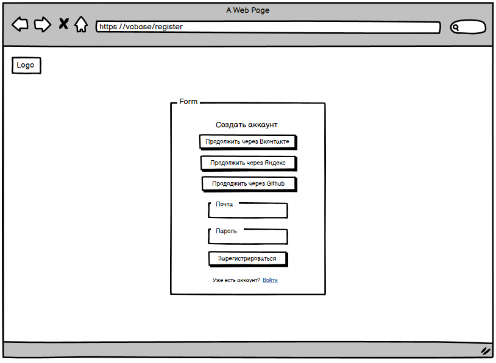

Рисунок 5 - Макет страницы создания аккаунта

Страница восстановления пароля включает форму с полем для ввода почты. После нажатия кнопки "Восстановить" на указанную почту отправляется письмо. Макет страницы представлен на рисунке 6.

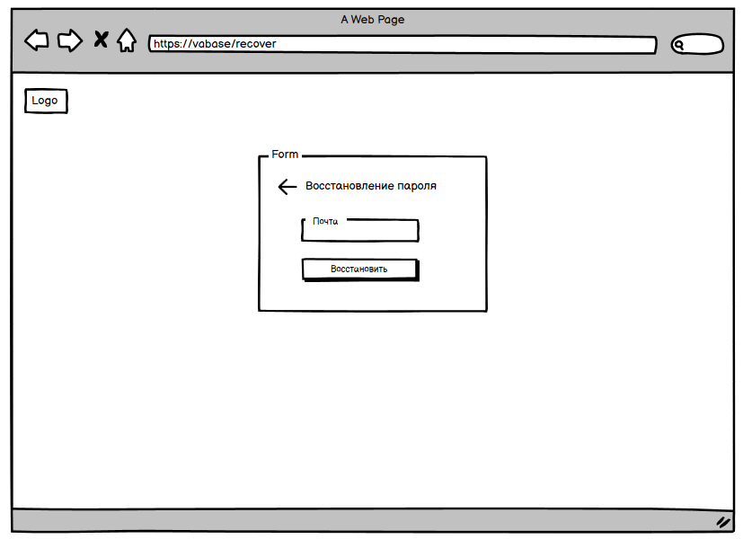

Рисунок 6 - Макет страницы восстановления пароля

Страница изменения пароля содержит форму с двумя полями: "Пароль" и "Повторение пароля". Перед её загрузкой токен проходит проверку на валидность; если токен недействителен, пользователь перенаправляется на страницу 404. Кнопка "Изменить" становится активной только при совпадении паролей. Макет страницы представлен на рисунке 7.

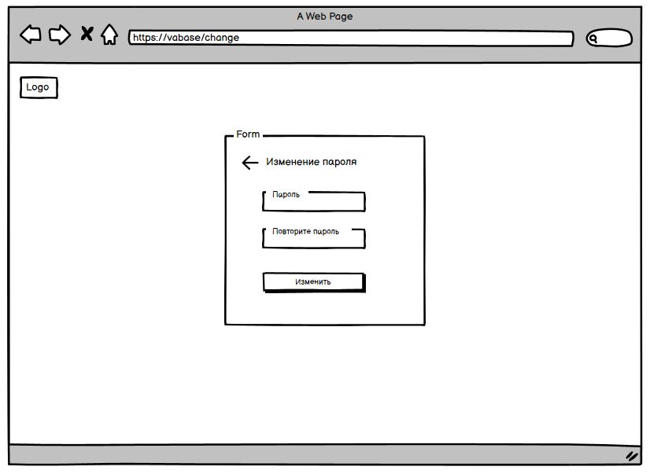

Рисунок 7 - Макет страницы изменения пароля

Страница обработки ответа от сервиса авторизации отображает индикатор загрузки, пока клиент отправляет запрос на сервер для авторизации. После получения ответа от сервиса происходит проверка данных. В случае успешной авторизации пользователя перенаправляют на главную страницу, в случае ошибки — отображается соответствующее сообщение. На рисунке 8 изображен макет страницы обработки ответа от сервиса авторизации.

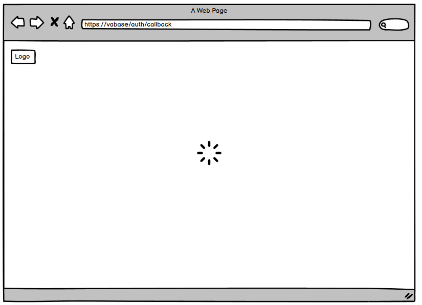

Рисунок 8 - Макет страницы обработки ответа от сервиса авторизации

Главная страница рабочего пространства предназначена для отображения важной информации для пользователей. На ней могут располагаться объявления, новости, а также различные руководства и инструкции, помогающие пользователю эффективно взаимодействовать с платформой. Страница служит отправной точкой для перехода к другим разделам и функционалу системы. На рисунке 9 изображен макет главной страницы рабочего пространства.

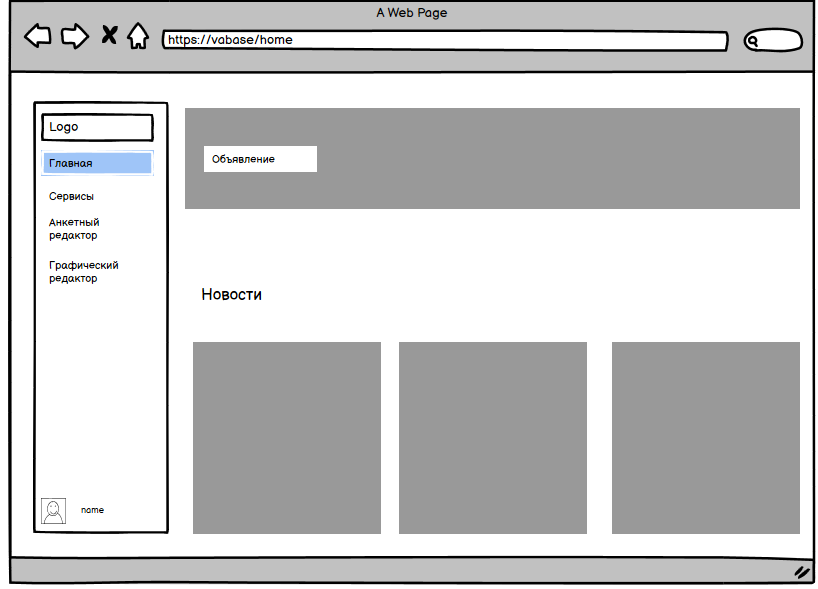

Рисунок 9 - Макет главной страницы рабочего пространства

Страница сервисов отображает карточки сервисов, добавленных пользователями. Каждая карточка содержит основную информацию о сервисе, такую как название, описание и другие важные детали. Пользователи могут сортировать сервисы по категориям, что позволяет быстро находить нужные услуги. Страница предоставляет удобный интерфейс для просмотра и взаимодействия с добавленными сервисами. На рисунке 10 изображен макет страницы сервисов.

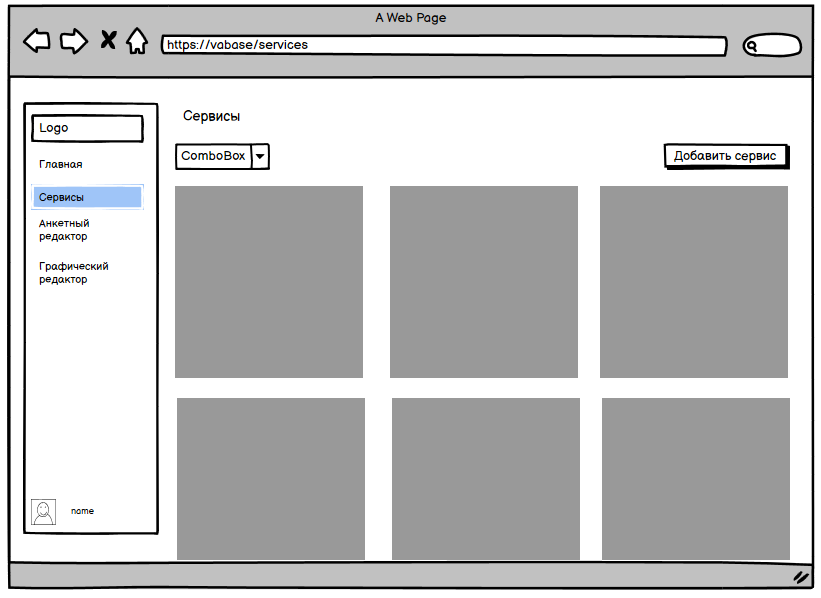

Рисунок 10 - Макет страницы сервисов

Страница выбранного сервиса предоставляет подробную информацию о сервисе. Помимо данных, отображаемых на карточке, здесь можно ознакомиться с дополнительными параметрами и настройками, которые позволяют пользователю лучше понять, как использовать сервис. На рисунке 11 изображен макет страницы выбранного сервиса.

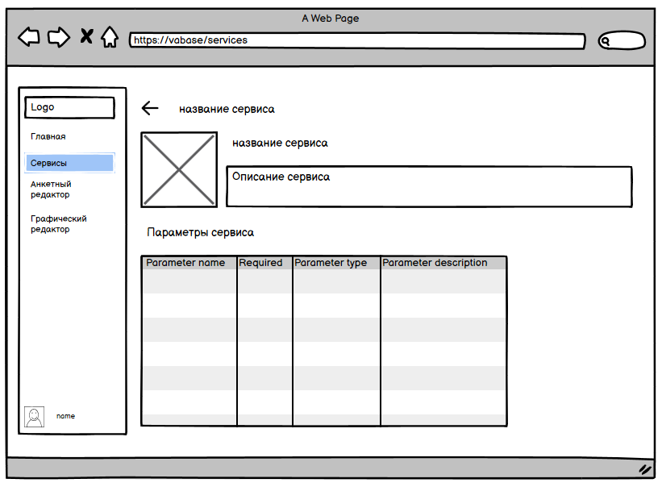

Рисунок 11 - Макет страницы выбранного сервиса

Страница добавления сервиса предназначена для ввода данных, необходимых для добавления нового сервиса в систему. Пользователь заполняет форму с нужной информацией, такой как название сервиса, описание, категории и другие параметры. После того как все поля заполнены, необходимо нажать на кнопку "Добавить", чтобы сохранить новый сервис в системе. На рисунке 12 изображен макет страницы добавления сервиса.

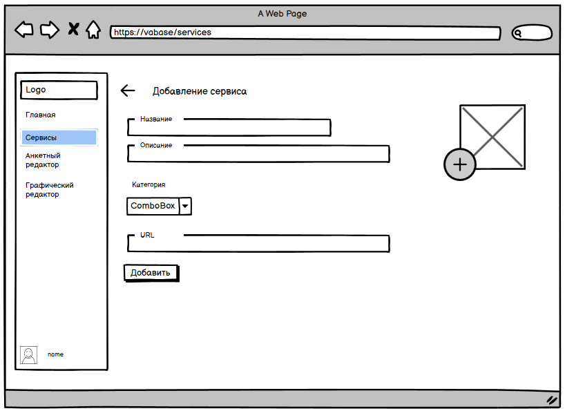

Рисунок 12 - Макет страницы добавления сервиса

Страница с данными аккаунта отображает всю информацию о пользователе, включая имя, почту, изображение и другие данные. Пользователь может просматривать свои данные и при необходимости изменять их. Например, при изменении имени появляется кнопка "Сохранить", которая становится активной для сохранения изменений. На рисунке 13 изображен макет страницы с данными аккаунта.

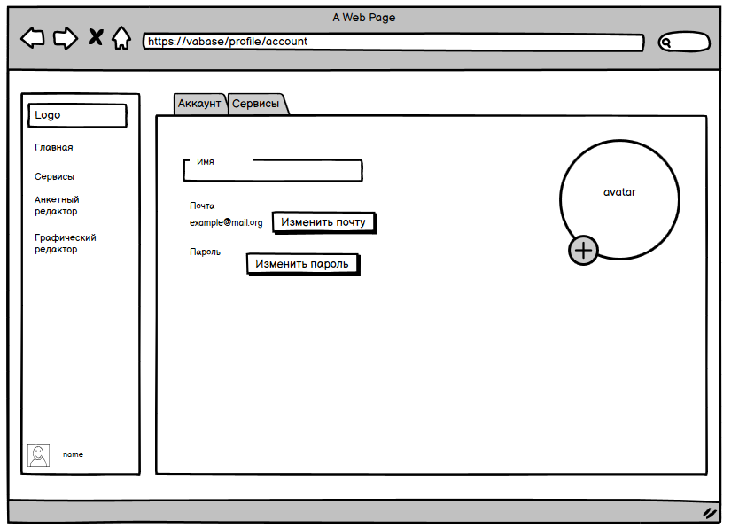
Рисунок 13 - Макет страницы с данными аккаунта

Страница привязанных сервисов позволяет пользователю подключать внешние сервисы к своему аккаунту. Для этого нужно выбрать нужный сервис из списка и нажать на кнопку "Подключить". После подключения сервисы будут отображаться в списке привязанных. На рисунке 14 изображен макет страницы с данными аккаунта.

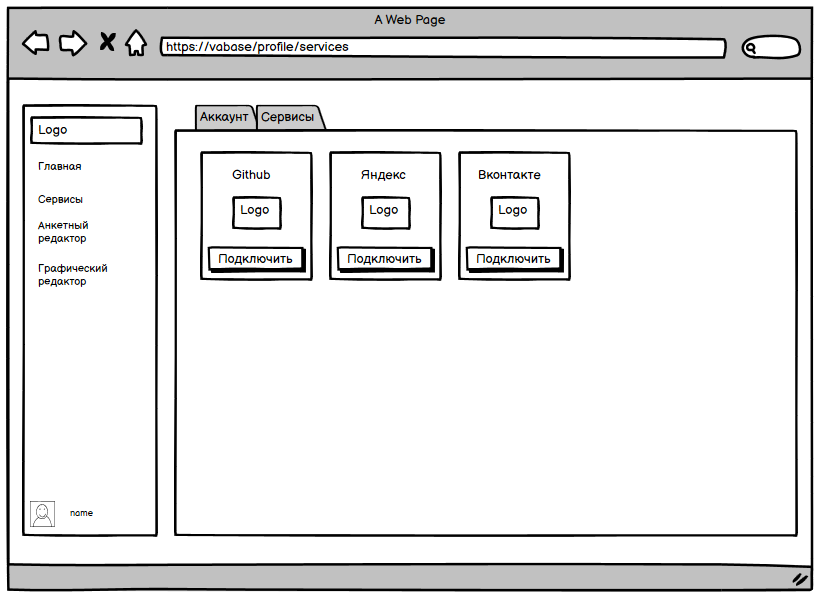

Рисунок 14 - Макет страницы привязанных сервисов к аккаунту

## Карта экранов

Карта экранов отображает связи между интерфейсами системы, показывая переходы между экранами и логику навигации. Она позволяет понять последовательность пользовательских действий и структуру приложения, обеспечивая ясность в организации интерфейса.

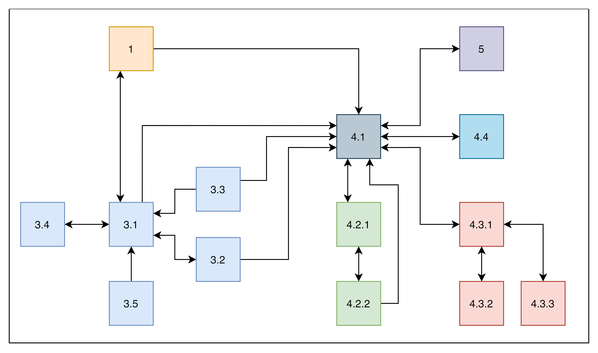

Рисунок 15 - Карта экранов
