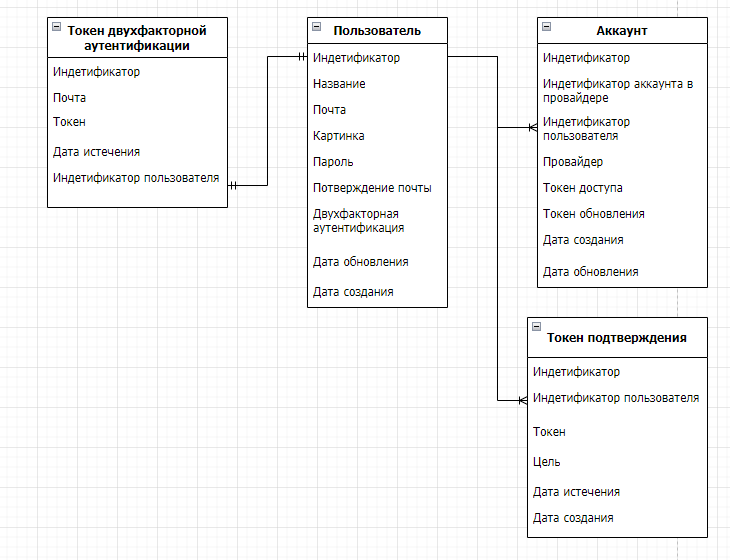

# Проектирование хранилища данных

Проектирование хранилища данных для платформы по управлению созданием виртуальных ассистентов основывается на интеграции множества внешних систем, каждая из которых имеет собственную базу данных и уникальную структуру. В рамках этой платформы нет необходимости создавать таблицы, непосредственно связанные с виртуальными ассистентами, поскольку все данные о них хранятся в системах, разработанных другими группами.

Ключевая задача платформы — создание и управление так называемым "суперпользователем", который служит единой точкой для объединения учетных записей из различных систем. Этот суперпользователь позволяет платформе эффективно управлять процессами авторизации, аутентификации и связывания аккаунтов без необходимости вносить изменения в существующие внешние системы.

Основное хранилище данных включает таблицы для пользователей, их привязки к внешним сервисам, таким как Яндекс, GitHub и ВКонтакте, а также данные, необходимые для обеспечения безопасности. Это решение позволяет создать гибкую инфраструктуру для управления данными, обеспечивая эффективную работу с внешними системами и их интеграцию в рамках единого процесса.

## Сущности и их атрибуты

### 1. **Пользователь**

Суперпользователь, который объединяет учетные записи разных систем.

**Атрибуты:**

- `Идентификатор` — уникальный идентификатор пользователя.
- `Название` — имя пользователя.
- `Почта` — адрес электронной почты.
- `Подтверждение почты` — дата и время подтверждения электронной почты.
- `Картинка` — ссылка на аватар пользователя.
- `Дата создания` — дата и время создания записи.
- `Дата обновления` — дата и время последнего обновления записи (обновляется автоматически).
- `Пароль` — пароль пользователя.
- `Двухфакторная аутентификация` — признак, включена ли двухфакторная аутентификация.

### 2. **Аккаунт**

Сущность, связывающая пользователя платформы с учетными записями в различных внешних системах.

**Атрибуты:**

- `Идентификатор` — уникальный идентификатор учетной записи.
- `Идентификатор пользователя` — идентификатор пользователя, к которому привязана учетная запись.
- `Провайдер` — провайдер авторизации (например, GitHub, VK, Yandex).
- `Идентификатор аккаунта в провайдере` — уникальный идентификатор учетной записи у провайдера.
- `Токен доступа` — токен доступа (опционально).
- `Токен обновления` — токен обновления (опционально).
- `Дата создания ` — дата и время создания записи.
- `Дата обновления` — дата и время последнего обновления записи.

### 3. **Токен двухфакторной аутентификации**

Сущность для управления двухфакторной аутентификацией.

**Атрибуты:**

- `Идентификатор` — уникальный идентификатор токена.
- `Почта` — адрес электронной почты, связанный с токеном.
- `Токен` — уникальный токен двухфакторной аутентификации.
- `Дата истечения` — дата и время истечения срока действия токена.
- `Идентификатор пользователя` — идентификатор пользователя, связанного с токеном.

### 4. **Токен подтверждения**

Сущность токенов для подтверждения особо важных действий пользователя.

**Атрибуты:**

- `Идентификатор` — уникальный идентификатор токена.
- `Идентификатор пользователя` — уникальный идентификатор пользователя, которому принадлежит токен.
- `Токен` — уникальный хеш токена подтверждения.
- `Цель` — цель создания данного токена.
- `Дата истечения` — дата и время истечения срока действия токена.
- `Дата создания` — дата и время создания токена.

## Логическая модель данных

Логическая модель данных представляет собой абстрактное описание структуры базы данных, включая сущности, их атрибуты и взаимосвязи между ними. Эта модель является основой для проектирования физической структуры данных, обеспечивая согласованность и удобство работы с информацией в рамках платформы. На рисунке 1 изображена логическая модель данных.

Рисунок 1 - Логическая модель данных

## Физическая модель данных

Физическая модель данных для платформы по управлению созданием виртуальных ассистентов описывает конкретное представление данных в базе данных, включая структуры таблиц, индексы, связи между ними, типы данных и механизмы обеспечения целостности данных. В отличие от логической модели, которая фокусируется на сущностях и их взаимосвязях, физическая модель учитывает особенности реализации на уровне базы данных, оптимизацию запросов и хранение информации. На рисунке 2 представлена физическая модель данных.

Рисунок 1 - Физическая модель данных

В физической модели можно увидеть таблицу prisma_migrations, которая создается автоматически при использовании Prisma для управления миграциями базы данных. Эта таблица служит для хранения информации о всех примененных миграциях, включая их идентификаторы, дату создания, статус выполнения и описание. Она необходима для синхронизации состояния базы данных с текущей Prisma-схемой, что обеспечивает целостность и актуальность структуры данных. Таблица используется во время выполнения миграций для упрощения управления версиями базы данных и минимизации возможных ошибок при внесении изменений.
