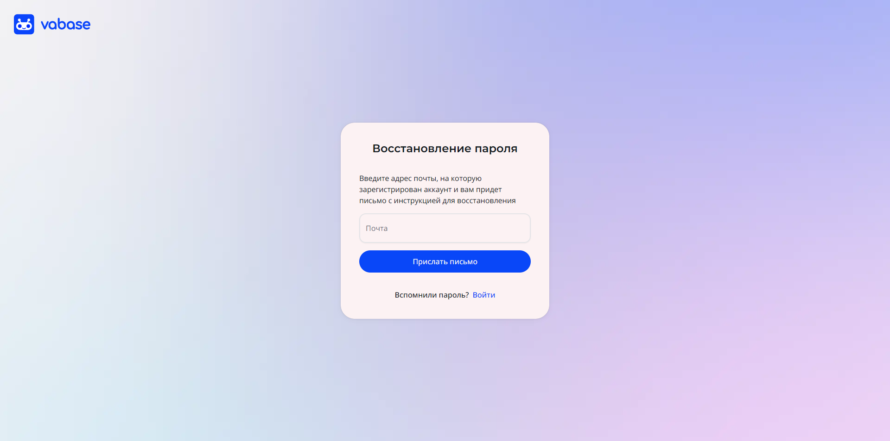

# Реализация

Ниже представлены скриншоты, демонстрирующие внешний вид и функциональность реализованных экранов. Они позволяют наглядно ознакомиться с итоговым результатом разработки и оценить соответствие готового интерфейса заявленным требованиям.

Логотип платформы является ее визуальным идентификатором, отражающим основную идею и концепцию. Он используется в шапке сайта, на страницах платформы и в документации. На рисунке 1 изображен логотип платформы.

Рисунок 1 - Логотип платформы

Главная страница платформы служит для первичного знакомства пользователей с функционалом. На ней размещены ключевые элементы, такие как логотип, кнопка для входа в систему и кнопка для создания аккаунта. Также представлена информация о преимуществах платформы и её возможностях, чтобы мотивировать посетителей зарегистрироваться и начать пользоваться сервисами. На рисунке 2 изображена главная страница.

Рисунок 2 - Главная страница

## Авторизация

Страница входа предоставляет форму для авторизации, где пользователи могут либо ввести свои данные вручную, либо выбрать авторизацию через сторонние сервисы. Также на странице предусмотрены кнопки для восстановления пароля и перехода к регистрации нового аккаунта. На рисунке 3 изображена страница входа в аккаунт.

Рисунок 3 - Страница авторизации

Страница регистрации содержит форму для создания аккаунта с необходимыми данными и кнопкой для отправки. Также есть возможность перейти на страницу входа. Страница регистрации продемонстрирована на рисунке 4.

Рисунок 4 - Страница регистрации

Страница восстановления пароля содержит форму для ввода почты, на которую будет отправлено письмо для восстановления. Страница изображена на рисунке 5.

Рисунок 5 - Страница восстановления пароля

На странице смены пароля нужно ввести новый пароль и подтвердить его. Перед загрузкой страницы токен из ссылки проверяется на валидность. Страница смены пароля изображена на рисунке 6.

Рисунок 6 - Страница смены пароля

Страница обработки ответа от OAuth-сервиса отображает индикатор загрузки, пока в фоне происходит взаимодействие с сервером для завершения процесса авторизации. Страница изображена на рисунке 7.

Рисунок 7 - Страница обработки авторизации через OAuth

На рисунке 8 продемонстрирована страница GitHub, где пользователь предоставляет доступ для авторизации на платформе.

Рисунок 8 - Авторизация через github

На рисунке 9 продемонстрирована страница Вконтакте, где пользователь предоставляет доступ для авторизации на платформе.

Рисунок 9 - Авторизация через Вконтакте

На рисунке 10 продемонстрирована страница Яндекса, где пользователь предоставляет доступ для авторизации на платформе.

Рисунок 10 - Авторизация через Яндекс

## Обработка токенов

Обработка токенов включает их проверку на валидность, управление их сроком действия и использование для обеспечения безопасности операций, таких как смена пароля, подтверждение почты и другие.

На рисунке 11 продемонстрировано сообщение о истечении токена подтверждения.

Рисунок 11 - Сообщение о истечении токена подтверждения

На рисунке 12 продемонстрировано сообщение об успешном подтверждении почты.

Рисунок 12 - Сообщение об успешном подтверждении почты

## Рабочее пространство

На рисунке 13 изображена страница рабочего пространства.

Рисунок 13 - Страница рабочего пространства
